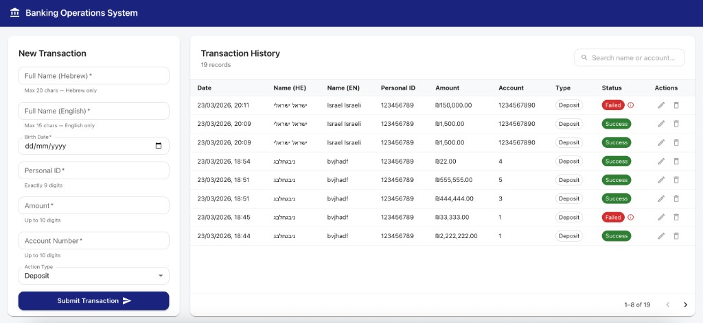
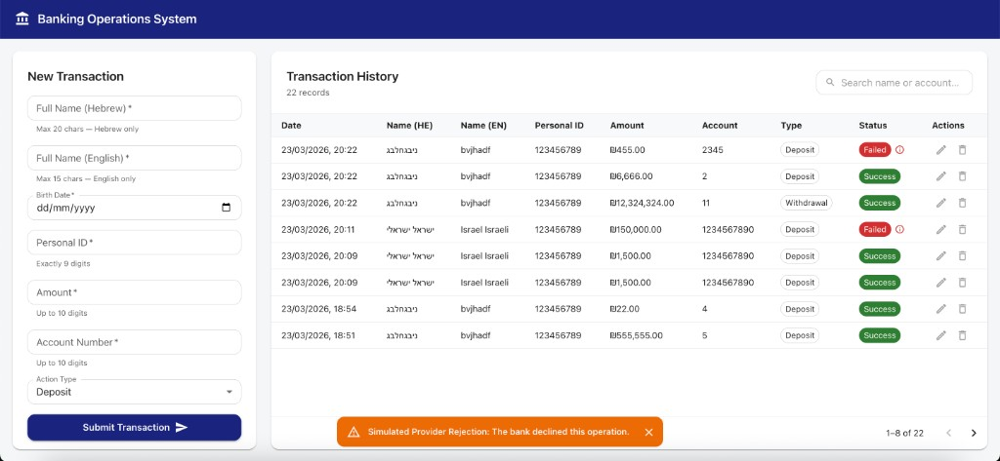
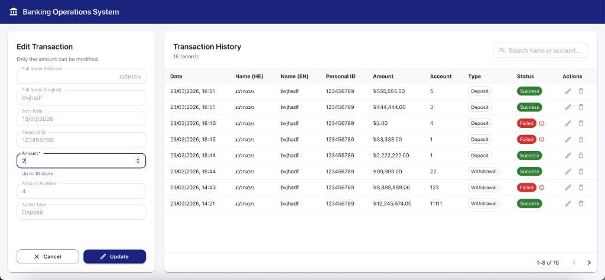
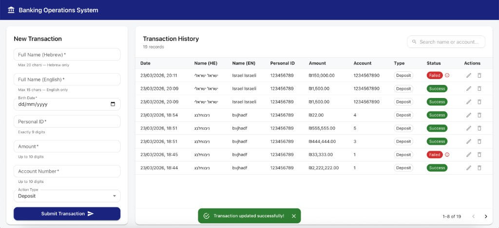

# Banking Operations System

A full-stack banking dashboard for processing, editing, and cancelling transactions — built with .NET 8, React, and SQLite.
The project implements full CRUD functionality, search bar and advanced logging as part of the extended system requirements.

---

## Stack

- **Backend:** ASP.NET Core 8 Web API · Entity Framework Core · SQLite
- **Frontend:** React (Vite) · Redux Toolkit · Material UI (MUI)

---

## Screenshots

**1. Main view — New Transaction**


**2. Simulated Provider Rejection**


**3. Edit Mode**


**4. After successful edit**


---

## How to Run

**Backend**
```bash
cd server
dotnet build       # verify the project compiles cleanly
dotnet run         # starts the API
```
> - API base URL: `http://localhost:5035/api`
> - Swagger UI: `http://localhost:5035/swagger` — explore and test all endpoints interactively without the frontend.
> - SQLite database is created automatically on first run.

**Frontend**
```bash
cd client
npm install
npm run dev
```
> App runs at `http://localhost:5173`. Requires the backend to be running first.

---

## Backend — The Main Logic

### Mock Bank Provider (80/20 Rule)
Every transaction is sent to a simulated external bank. It succeeds **80%** of the time and fails **20%**, returning a random reason (`Timeout`, `Insufficient Funds`, `System Error`). This tests how the system handles real-world bank rejections without needing a live API.

### Token Authentication
Before each bank call, a token is requested using:
- `personalId` — the customer's ID
- `secretId` — hardcoded constant `"Je45GDf34"`

These are sent as a JSON payload to the `/createtoken` endpoint (simulated).

### Smart Edit Logic
Editing a transaction behaves differently based on its current status:

| Current Status | Behaviour | Date Updated? |
|---|---|---|
| `Success` | **Correction** - only the amount is updated in SQLite | No - original date kept |
| `Failed` | **Retry** - a new bank request is made, status/reason refresh | Yes - set to `DateTime.UtcNow` |

### Structured Logging
Every operation produces a log with a clear prefix:
- `[SIMULATED]` - bank rejected the transaction (expected, business-level outcome)
- `[TECHNICAL]` - an actual code exception occurred (needs developer attention)

---

## Validation

Both layers enforce the same rules independently — the frontend for instant UX feedback, the backend as the authoritative contract.

| Field | Frontend (React) | Backend (Data Annotations) |
|---|---|---|
| Full Name (Hebrew) | Required · max 20 chars · Hebrew letters, spaces, `-`, `'` only | `[Required]` `[MaxLength(20)]` `[RegularExpression]` |
| Full Name (English) | Required · max 15 chars · English letters, spaces, `-`, `'` only | `[Required]` `[MaxLength(15)]` `[RegularExpression]` |
| Birth Date | Required · must be before today | `[Required]` · stored as `DateOnly` · controller rejects `>= DateTime.Today` with `[VALIDATION]` log |
| Personal ID | Required · exactly 9 digits | `[Required]` `[RegularExpression(@"^\d{9}$")]` |
| Amount | Required · positive · max `9,999,999,999.99` | `[Required]` `[Range(0.01, 9999999999.99)]` · `decimal(10,2)` |
| Account Number | Required · 1–10 digits only | `[Required]` `[RegularExpression(@"^\d{1,10}$")]` |
| Action Type | Required · Deposit or Withdrawal | `[Required]` · `ActionType` enum |

> The controller calls `ModelState.IsValid` before passing the request to the service layer. Invalid requests return `400 Bad Request` with field-level error messages.

---

## Frontend — The UX Logic

### Layout
Single-page dashboard with a **25% / 75%** (3/12 and 9/12 MUI Grid) split (Form left, History right). Equal height on desktop, stacks vertically on mobile.

### Left Panel Component Swap
The left panel is controlled by Redux `editingTransaction` state:
- `null` → shows **New Transaction** form
- `{transaction}` → swaps to **Edit Mode** with all fields disabled except Amount

### Actions Column
Each table row has two icon buttons:
- **Edit** — grey by default, turns **blue** on hover
- **Delete** — grey by default, turns **red** on hover
- Both actions require confirmation via an MUI Dialog before executing

### Failed Transaction Tooltip
When a transaction has `Failed` status, a small **ⓘ info icon** appears next to the red chip. Hovering over it shows a navy-themed tooltip with the specific failure reason (e.g. `Insufficient Funds`), so the reason is always accessible without cluttering the table.

### Snackbar Feedback
| Event | Severity | Message |
|---|---|---|
| Transaction processed (Success) | ✅ success | ` Deposit of ₪1,500 processed successfully` |
| Bank rejected (Simulated) | ⚠️ warning | `Simulated Provider Rejection: The bank declined this operation.` |
| System exception | ❌ error | `System Error: A technical issue occurred. Please check the logs.` |
| Transaction updated | ✅ success | `Transaction updated successfully!` |
| Transaction deleted | ✅ success | `Transaction cancelled and removed.` |

---

## Assumptions

- **Failed transactions are permanent records** — a failed bank response is saved to the DB as-is; it is not rolled back or hidden.
- **Only Amount is editable** — names, personal ID, and account number are treated as immutable identity data after creation.
- **"Cancel" is a hard delete** — removing a transaction permanently deletes the row; there is no soft-delete or "Cancelled" status.
- **No user authentication** — any caller can create, edit, or delete any transaction. Out of scope for this demo.
- **Mock provider URLs are intentionally fake** — the `try/catch` in `SendPostRequestAsync` silently swallows the network error; the 80/20 logic runs regardless.
- **`SecretId` is a hardcoded constant** — in a production system this would be pulled from a secrets manager or environment variable, not the source code.
- **Client-side pagination** — all transactions are fetched in a single API call and paginated locally in Redux. This is intentional for a demo dataset. At scale, server-side pagination with `?page=&pageSize=` query params would be the right approach.
- **No timezone handling** — `TransactionDate` is stored and returned as `DateTime.UtcNow`; the frontend displays it in the browser's local locale.
- **BirthDate validation** — Dates are accepted up to yesterday. Today and future dates are blocked on both frontend and backend. This supports accounts for minors/babies managed by guardians; a date of today could indicate a data entry error and is explicitly rejected and logged.

---

## Architectural Choices

- **Redux as Single Source of Truth** — after every POST/PUT/DELETE, the Redux `list` is updated directly from the API response. No manual re-fetch needed; the UI reflects changes instantly.
- **SQLite** — zero configuration, no server to run, database file travels with the project.
- **MUI** — consistent, accessible components out of the box. Theme configured once in `main.jsx` (navy primary, system fonts, 12px border radius).
- **`DateOnly` for BirthDate** — .NET's `DateOnly` type with a custom EF Core converter ensures no time-zone noise on date-only values.
